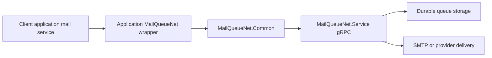

---
title: Client Integration Guide
sidebar_position: 4
---

This guide is for application teams integrating with MailQueueNet from a client application.
It focuses on the practical decisions that came up during the first production-style client integration.

Use this page when you need to answer:

- Which NuGet package should the client reference?
- How should the gRPC client be configured?
- When should SMTP settings be supplied by the client?
- How do attachments work when the MailQueueNet service is remote?
- How should staging pass-through recipient allow-lists be managed?
- What should be logged and exposed in an application admin UI?

## Recommended integration shape

Most client applications should add a small application-owned wrapper around `MailQueueNet.Common` rather than calling the generated gRPC client everywhere.

A wrapper gives the consuming application one place to handle:

- service address and client credentials
- retry and disk resilience settings
- attachment token upload behaviour
- optional per-message SMTP settings
- staging pass-through allow-list management
- logging and health checks
- application-specific return types

Typical dependency flow:



## Minimum package and namespaces

Reference the client package:

```xml
<PackageReference Include="MailQueueNet.Common" Version="4.7.0" />
```

Common namespaces used by client integrations:

```csharp
using System.Net.Mail;
using Grpc.Net.Client;
using MailQueueNet.Grpc;
```

## Configuration checklist

A client integration normally needs two configuration sections:

1. Application-owned settings that describe how the client wants to use MailQueueNet.
2. Optional `MailClientConfigurationSettings` if you use the built-in static initialiser pattern.

A practical application-owned section might look like this:

```json
{
  "MailQueueNet": {
    "ServiceChannelAddress": "https://mailqueue.example.internal:5001",
    "ClientId": "my-client",
    "SharedSecret": "<secret>",
    "AllowInsecureCertificate": false,
    "EnableDiskResilience": true,
    "UndeliveredFolder": "D:\\mailqueue\\undelivered",
    "RetryCount": 5,
    "RetryBackoffFactor": 2.0,
    "UnsentCheckIntervalMinutes": 10,
    "ResendWindowHours": 72,
    "DistributedLockTimeoutSeconds": 300,
    "LockFileName": ".resend.lock",
    "AlertEmailAddress": "ops@example.com",
    "AllowedTestRecipientEmailAddresses": []
  }
}
```

### Recommended setting ownership

| Setting | Recommended owner | Notes |
| --- | --- | --- |
| `ServiceChannelAddress` | Client app config | Required to locate the gRPC service. |
| `ClientId` | Client app config | Used for auth and per-client staging allow-lists. |
| `SharedSecret` | Secret store or environment config | Do not commit real values. |
| `UndeliveredFolder` | Client app config | Use durable storage. Use shared storage for multi-instance clients. |
| Retry settings | Client app config | Tune per application workflow tolerance. |
| SMTP settings | Prefer service config | Only supply per-message/client SMTP settings when the application must override service defaults. |
| Staging allow-list | Local environment appsettings | Only valid in `Development` or `Staging`. Do not enable in production UI. |

## Basic queueing wrapper

The generated `MailGrpcServiceClient` is usable directly, but a wrapper keeps the rest of the application independent from gRPC details.

```csharp
public sealed class ExampleMailQueueClient : IDisposable
{
    private readonly GrpcChannel channel;
    private readonly MailGrpcService.MailGrpcServiceClient grpcClient;
    private readonly MailGrpcServiceClientWithRetry retryClient;

    public ExampleMailQueueClient(MailClientConfiguration configuration, string clientId, string sharedSecret)
    {
        MailClientConfiguration.Current = configuration;

        MailGrpcService.MailGrpcServiceClient.ConfigureClientAuth(
            clientIdValue: clientId,
            sharedSecretValue: sharedSecret);

        // Configure auth before creating or using the retry wrapper. Queueing,
        // bulk queueing, mail-merge queueing, and disk-resilience resend calls
        // all use these client credentials when the service requires them.

        this.channel = GrpcChannel.ForAddress(configuration.MailQueueNetServiceChannelAddress);
        this.grpcClient = new MailGrpcService.MailGrpcServiceClient(this.channel);
        this.retryClient = new MailGrpcServiceClientWithRetry(
            this.grpcClient,
            configuration,
            Microsoft.Extensions.Logging.Abstractions.NullLogger<MailGrpcServiceClientWithRetry>.Instance);
    }

    public async Task<bool> QueueAsync(MailMessage message, CancellationToken cancellationToken = default)
    {
        var reply = await this.retryClient.QueueMailWithRetryAndResilienceAsync(
            message,
            cancellationToken);

        return reply.Success;
    }

    public void Dispose()
    {
        this.channel.Dispose();
    }
}
```

## SMTP settings: when to pass them and when not to

MailQueueNet can use SMTP/provider settings configured on the service.
Most clients should call queue methods without per-message settings and let the service decide how mail is delivered.

Use the default queue methods when:

- the service owns SMTP/provider configuration
- staging routing should use service-level Mailpit and real SMTP settings
- you want operations staff to update delivery settings without redeploying clients

```csharp
await retryClient.QueueMailWithRetryAndResilienceAsync(message, cancellationToken);
```

Only use `QueueMailWithSettingsWithRetryAsync(...)` when the client application genuinely owns the SMTP settings for that specific message or tenant.

```csharp
var settings = new MailSettings
{
    Smtp = new SmtpMailSettings
    {
        Host = "smtp.example.com",
        Port = 587,
        RequiresSsl = true,
        RequiresAuthentication = true,
        Username = "smtp-user",
        Password = "smtp-password",
        ConnectionTimeout = 100000,
    },
};

await retryClient.QueueMailWithSettingsWithRetryAsync(
    message,
    settings,
    cancellationToken);
```

:::tip
If your existing application has optional SMTP settings, treat a missing SMTP host as "use MailQueueNet defaults" rather than as a configuration error.
:::

## Attachments from remote clients

When the service is remote, do not assume the service can read the client's local attachment file path.
Use the helper queue methods or explicit upload helpers so attachments are uploaded and replaced with attachment tokens.

Recommended options:

- Use `QueueMail...` helper methods that automatically upload file-backed attachments when needed.
- Or explicitly call `UploadAttachmentsAndApplyTokensAsync(...)` before queueing.

Important constraints:

- Prefer file-backed `System.Net.Mail.Attachment` instances.
- For stream-created attachments, write a temporary file first if you need the built-in upload helpers.
- Dispose `MailMessage` after queueing to release attachment file handles.

## Staging pass-through recipient allow-list

MailQueueNet 4.7.0 includes staging-specific routing:

- in `Staging`, all mail is captured by Mailpit by default
- selected recipient addresses can be allow-listed per client id
- allow-listed recipients also receive a real SMTP copy
- non-allow-listed recipients are stripped from the real SMTP copy

### Client-side source of truth

For client applications with local developers sharing a database, keep the desired list in local environment configuration rather than shared database state.

Example:

```json
{
  "MailQueueNet": {
    "AllowedTestRecipientEmailAddresses": [
      "developer@example.com",
      "tester@example.com"
    ]
  }
}
```

The client app should mirror this local list to MailQueueNet on startup.
The local appsettings file remains the source of truth.

### Environment guard

Only apply or show staging pass-through management in these environments:

- `Development`
- `Staging`

Use `ASPNETCORE_ENVIRONMENT` via `IHostEnvironment` in ASP.NET Core or Blazor Server applications.

```csharp
if (!environment.IsDevelopment() && !environment.IsStaging())
{
    return;
}
```

Do not show pass-through management controls in production.
Do not sync the allow-list in production.

### Sync algorithm

The sync should make MailQueueNet exactly match the local list for the authenticated client id.

```csharp
var desired = localAddresses
    .Where(address => !string.IsNullOrWhiteSpace(address))
    .Select(address => address.Trim())
    .Distinct(StringComparer.OrdinalIgnoreCase)
    .ToArray();

var existing = await client.ListAllowedTestRecipientEmailAddressesAsync(
    clientId,
    cancellationToken: cancellationToken);

foreach (var address in desired.Except(existing, StringComparer.OrdinalIgnoreCase))
{
    await client.AddAllowedTestRecipientEmailAddressAsync(
        address,
        clientId,
        cancellationToken: cancellationToken);
}

foreach (var address in existing.Except(desired, StringComparer.OrdinalIgnoreCase))
{
    await client.RemoveAllowedTestRecipientEmailAddressAsync(
        address,
        clientId,
        cancellationToken: cancellationToken);
}
```

### GUI management pattern

If the client app exposes an admin UI for the allow-list:

1. Hide the UI outside `Development` and `Staging`.
2. Add/remove addresses in the local environment appsettings file first.
3. Immediately run the same mirror sync to MailQueueNet.
4. Refresh the displayed list from MailQueueNet or from the saved local list.
5. Log sync failures, but avoid blocking unrelated mail queue administration features.

:::warning
The allow-list is per authenticated MailQueueNet client id. Configure client authentication before calling allow-list endpoints.
:::

## Health checks and admin UI recommendations

A good client integration should expose enough operational information for support staff to answer "did we queue it?" and "is MailQueueNet healthy?".

Recommended client-side admin features:

- service health check status
- folder summary counts
- failed queue item list
- retry/delete actions for failed items where appropriate
- processing status and pause/resume controls if the user is authorised
- staging pass-through list management only in `Development` or `Staging`
- recent mail merge batches if the app uses MailForge
- clear log messages for queue success, disk fallback, and hard failure

Useful gRPC calls include:

- `GetFolderSummaryAsync(...)`
- `ListMailFilesAsync(...)`
- `ReadMailFileAsync(...)`
- `RetryFailedMailsAsync(...)`
- `DeleteMailsAsync(...)`
- `GetProcessingStatusAsync(...)`
- `PauseProcessingAsync(...)`
- `ResumeProcessingAsync(...)`
- `GetUsageStatsAsync(...)`
- `ListMailMergesAsync(...)`
- `ListMergeDispatchStateAsync(...)`
- `GetAttachmentStatsAsync(...)`

## Logging recommendations

Log these events in the client application:

- effective MailQueueNet service address
- whether disk resilience is enabled
- undelivered folder path, but not message content
- masked client id/shared secret presence
- queue accepted count and failed count
- when mail is saved to disk for later retry
- startup allow-list sync result in `Development` or `Staging`
- sync failures with enough context to diagnose environment and client id issues

Do not log:

- SMTP passwords
- shared secrets
- full message bodies unless the environment and support process explicitly allow it
- recipient lists in high-volume production logs unless required for support and privacy requirements permit it

## Common pitfalls

### Forgetting client auth

If client auth is enabled on the service, configure it once during client startup:

```csharp
MailGrpcService.MailGrpcServiceClient.ConfigureClientAuth(
    clientIdValue: "my-client",
    sharedSecretValue: "shared-secret");
```

The same authenticated client id is used for staging allow-list ownership.

### Passing SMTP settings unnecessarily

Passing per-message SMTP settings moves delivery configuration into the client.
Prefer service defaults unless there is a real tenant-specific override requirement.

### Treating staging pass-through as production functionality

The pass-through allow-list is a staging safety feature.
Hide it and skip sync outside `Development` and `Staging`.

### Using local-only attachment paths with a remote service

A remote service cannot read `C:\...` files from the client machine.
Use attachment token upload helpers.

### Running multiple client instances with separate undelivered folders

If each instance has its own `UndeliveredFolder`, backlogs may drain unpredictably during outages.
For multi-instance deployments, prefer durable shared storage plus the lock-file gate.

